# CCPM 協作指南 (Claude Code Project Manager)

> **版本**: 1.0  
> **更新日期**: 2025-09-13  
> **適用專案**: Text Correction Project  

## 🤖 什麼是 CCPM？

**CCPM (Claude Code Project Manager)** 是基於 Claude Code 的智能專案管理工作流程，結合了：
- **AI 驅動的開發**：Claude Code 作為主要開發者
- **Git Worktree 策略**：隔離式功能開發
- **Issue 追蹤**：GitHub Issues 整合
- **自動化流程**：測試、部署、文檔生成

## 🏗️ 專案結構

### Git Worktree 架構
```
主專案/
├── text-correction-backend/              # 主分支 (main)
│   ├── .env                             # 生產環境配置
│   ├── src/                             # 穩定版本程式碼
│   └── package.json
│
├── text-correction-backend-auth-worktree/ # 功能分支 (worktree)
│   ├── .env                             # 開發環境配置
│   ├── .claude/epics/                   # Epic 管理
│   ├── database/migrations/             # 資料庫遷移
│   └── SUPABASE_SETUP_GUIDE.md          # 功能文檔
│
└── text-correction-frontend/             # 前端專案
    ├── .env                             # 前端環境變數
    └── src/
```

### 為什麼使用 Worktree？

| 優勢 | 說明 |
|------|------|
| **隔離開發** | 新功能不影響穩定的主版本 |
| **並行服務** | 主服務繼續運行，新功能獨立測試 |
| **乾淨切換** | 無需 stash 即可切換工作內容 |
| **風險控制** | 實驗性功能不會破壞主分支 |

## 🔄 CCPM 工作流程

### 1. Epic 管理

```mermaid
graph LR
    A[Epic 規劃] --> B[建立 Worktree]
    B --> C[Issue 分解]
    C --> D[開發實作]
    D --> E[測試驗證]
    E --> F[合併主分支]
    F --> G[部署上線]
```


### 2. Issue 生命週期

#### Phase 1: 開始 Issue
```bash
# CCPM 自動執行：
git worktree add ../project-feature-worktree feature-branch
cd ../project-feature-worktree
# 建立 .claude/epics/[Epic Name]/updates/[issue]/progress.md
```

#### Phase 2: 開發過程
```bash
# CCPM 持續追蹤：
- 程式碼實作
- 自動測試
- 進度更新
- GitHub Issue 同步
```

#### Phase 3: 完成驗證
```bash
# 測試流程：
npm test                    # 單元測試
npm run dev                 # 啟動服務
curl http://localhost:3001/health  # API 測試
```

#### Phase 4: 合併主分支
```bash
# 完成後合併：
git push origin feature-branch
gh pr create
gh pr merge
```

## 🤝 與 CCPM 協作方式

### 1. 溝通原則

#### ✅ 有效的指令方式
```
✅ "開始 Issue #3：實作使用者認證"
✅ "測試 Supabase 連線"
✅ "合併 auth-worktree 到主分支"
✅ "建立 API 文檔"
```

#### ❌ 避免的指令方式
```
❌ "做一些認證功能"  (太模糊)
❌ "修復所有問題"    (範圍不明確)
❌ "隨便改改看"      (缺乏目標)
```

### 2. Plan Mode 理解

當 CCPM 進入 **Plan Mode** 時：
- 🔍 **只會分析和規劃**，不會修改任何檔案
- 📋 **提供詳細執行計畫**
- ⏸️ **等待您確認**後才開始執行
- 🎯 **確保工作方向正確**

```
[Plan Mode 範例]
用戶："幫我設定 Supabase"
CCPM：分析需求 → 制定計畫 → 等待確認 → 執行
```

### 3. 進度追蹤

CCPM 使用多層級追蹤：
- **GitHub Issues**：官方進度記錄
- **TodoWrite**：即時任務追蹤
- **Progress.md**：詳細進度文檔
- **Commit Messages**：程式碼變更記錄

## 🧪 測試和驗證流程

### 1. 開發環境測試

#### 啟動 Worktree 服務
```bash
cd text-correction-backend-auth-worktree
npm run dev  # 通常使用 Port 3001
```

#### API 測試
```bash
# 健康檢查
curl http://localhost:3001/health

# Supabase 連線測試
curl http://localhost:3001/api/v1/auth/status

# 文字校正功能
curl -X POST http://localhost:3001/api/v1/text/correct \
  -H "Content-Type: application/json" \
  -d '{"text": "測試文本"}'
```

### 2. 前後端整合測試

#### 更新前端環境變數
```bash
# 修改 frontend/.env
VITE_API_BASE_URL=http://localhost:3001
```

#### 啟動前端
```bash
cd text-correction-frontend
npm run dev  # Port 5173
```

### 3. 完整功能測試

1. **認證流程**：Google OAuth 登入
2. **API 調用**：文字校正請求
3. **資料持久化**：使用記錄儲存
4. **錯誤處理**：異常情況處理

## 📂 環境變數管理

### 主專案 (.env) - 生產環境
```env
# 基本設定
NODE_ENV=production
PORT=3000

# API 金鑰 (生產)
OPENAI_API_KEY=sk-prod-...
SUPABASE_URL=https://prod.supabase.co
```

### Worktree (.env) - 開發環境
```env
# 基本設定
NODE_ENV=development
PORT=3001

# API 金鑰 (開發)
SUPABASE_URL=https://qcmamgtwharlsiwjzikc.supabase.co
SUPABASE_PUBLISHABLE_KEY=sb_publishable_...
SUPABASE_SECRET_KEY=sb_secret_...
GOOGLE_CLIENT_ID=您的Google OAuth Client ID
GOOGLE_CLIENT_SECRET=您的Google OAuth Client Secret
```

## 🔧 常用指令參考

### Git Worktree 管理
```bash
# 建立新的 worktree
git worktree add ../project-feature-worktree feature-branch

# 列出所有 worktrees
git worktree list

# 移除 worktree
git worktree remove ../project-feature-worktree

# 在 worktree 間切換
cd ../project-feature-worktree
```

### 環境管理
```bash
# 安裝依賴
npm install

# 啟動開發服務
npm run dev

# 執行測試
npm test

# 建構生產版本
npm run build
```

### GitHub 整合
```bash
# 建立 Pull Request
gh pr create --title "feat: 新功能" --body "詳細說明"

# 查看 Issue
gh issue view 2

# 更新 Issue 進度
gh issue comment 2 --body "進度更新"

# 合併 PR
gh pr merge --squash
```

## 🚀 最佳實踐

### 1. 環境隔離
- **開發**：使用 worktree 環境
- **測試**：在獨立端口測試
- **生產**：主分支部署

### 2. 資料備份
- **定期提交**：小步快跑，頻繁提交
- **進度同步**：及時推送到 GitHub
- **環境文檔**：記錄設定步驟

### 3. 溝通協作
- **清晰指令**：明確表達需求
- **確認計畫**：理解 CCPM 的執行方案
- **及時回饋**：測試結果和問題反饋

## 🛠️ 故障排除

### 常見問題

#### 1. Port 衝突
```bash
# 檢查端口佔用
lsof -i :3000
lsof -i :3001

# 終止佔用進程
kill -9 [PID]
```

#### 2. 環境變數問題
```bash
# 檢查環境變數載入
node -e "console.log(process.env.SUPABASE_URL)"

# 重新載入環境
source .env
```

#### 3. Git Worktree 問題
```bash
# 清理無效的 worktree
git worktree prune

# 重新建立 worktree
git worktree add --force ../project-feature-worktree feature-branch
```

### 支援資源

- **GitHub Issues**: [專案 Issues 頁面]
- **文檔**: 各種 `*_GUIDE.md` 檔案
- **CCPM**: Claude Code 直接詢問

---

## 📋 當前專案狀態

### 🎯 Current Epic: Auth + Usage Tracking
- **Branch**: `auth-usage-tracking-epic`
- **Worktree**: `text-correction-backend-auth-worktree`
- **Issue #2**: Database & Auth Setup (90% 完成)

### 📂 重要檔案位置
- **設定指南**: `text-correction-backend-auth-worktree/SUPABASE_SETUP_GUIDE.md`
- **環境變數**: `text-correction-backend-auth-worktree/.env`
- **進度追蹤**: `.claude/epics/Auth + Usage Tracking/updates/2/progress.md`

### 🔄 下一步
1. 完成 Issue #2 的 Google OAuth 整合
2. 測試完整認證流程
3. 合併到主分支
4. 開始 Issue #3：前端認證整合

---

> 📖 **這份指南會隨專案發展持續更新**  
> 🤖 **Generated with CCPM (Claude Code Project Manager)**  
> 📅 **Last Updated**: 2025-09-13